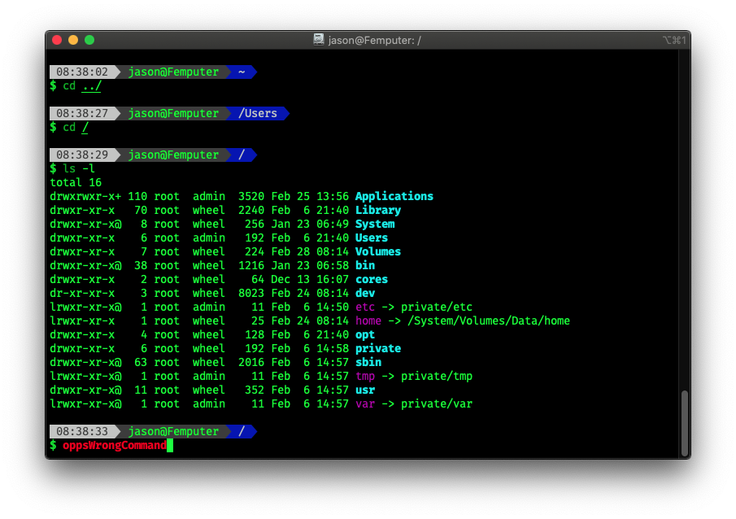

# zsh-config

## WARNING Use at your own risk!
This will erase your current .zshrc config and possibly other settings. Back it up if it's important to you.

---

Run this to deploy  
`curl -fsSL "https://raw.github.com/jgranzow86/zsh_custom/master/deploy.sh" |sh`

Sample Image  
